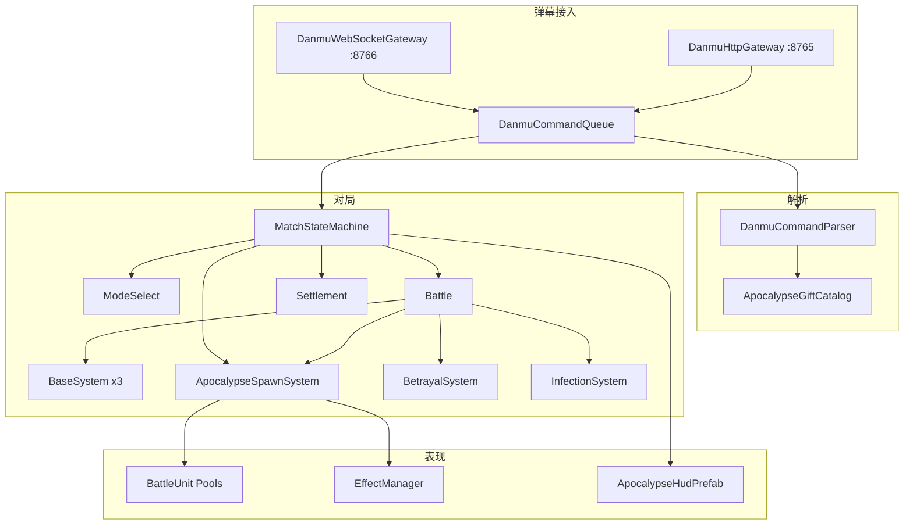

# 【末日之王】Unity 开发设计说明

版本：1.0  
日期：2026-06-01  
依据：`doc/【末日之王】开播指引.md`（风响互游 v1.0.9）  
工程：`douyin-danmu-Unity3D`（Unity 2022.3 LTS，Built-in）

---

## 1. 目标与范围

### 1.1 产品目标

实现与官方开播指引一致的 **抖音弹幕 3D 三阵营对战**：

- 观众 `1` / `2` / `3` 加入蓝军、绿军、丧尸大军；
- 点赞、`666`、八档礼物按表召唤对应兵种与数量；
- 对局以 **摧毁敌方基地** 或 **倒计时结束比基地血量/积分** 定胜负；
- 可选 **叛变**（丧尸基地被毁后人类一方概率联手丧尸）、**感染**、**核武倒计时**、**狂暴点赞**；
- 结算展示积分池/胜点瓜分（平台 API 未接入前用本地 Mock）。

### 1.2 本仓库职责边界

| 在 Unity 内实现 | 通常由平台/后端实现 |
|-----------------|---------------------|
| 3D 战场、单位、特效、镜头 | 抖音礼物 ID、openid |
| 弹幕/礼物/点赞协议解析与出兵 | 周榜/月榜持久化 |
| 对局规则、基地 HP、叛变/感染 | 胜点质押、铭牌 TOP 排名 |
| 模式选择 UI、结算 UI（Mock 数据） | 积分池 30%/70% 跨局持久化 |

### 1.3 与当前原型的差异

当前 `ApocalypseKingUnityGame` 为 **人族 vs 兽族巨人** 双阵营原型。本设计将其演进为 **蓝 / 绿 / 丧尸** 三阵营，并保留现有对象池、`UnitConfig`、`EffectManager`、弹幕网关。

---

## 2. 系统架构



### 2.1 模块划分

| 模块 | 路径 | 职责 |
|------|------|------|
| 阵营/阶段 | `Assets/Scripts/ApocalypseKing/FactionId.cs`, `MatchPhase.cs` | 枚举与阶段常量 |
| 对局配置 | `ApocalypseMatchSettings.cs` | 基地血量、时长、叛变开关 |
| 礼物表 | `ApocalypseGiftCatalog.cs` | 八档礼物 × 三阵营出兵数量 |
| 基地 | `ApocalypseBaseState.cs` | 单基地 HP、位置、归属 |
| 对局机 | `ApocalypseKingUnityGame.Match.cs` | 阶段切换、计时、胜负 |
| 出兵 | `ApocalypseKingUnityGame.ApocalypseSpawn.cs` | 按礼物/点赞批量复活单位 |
| 弹幕 | `DanmuCommand*.cs` | 扩展 Join/Like/Gift 与阵营 |
| 战斗 | 既有 `UnitRuntime`, `BattleState`, `Damage` | 目标选择扩展叛变/感染 |

---

## 3. 数据模型

### 3.1 阵营 `FactionId`

| 值 | 文档名称 | 战斗侧 | 出生区域（世界 X） |
|----|----------|--------|-------------------|
| Blue | 人类蓝军 | HumanAlliance | `Left + 120` 一带 |
| Green | 人类绿军 | HumanAlliance | `Right - 120` 一带 |
| Zombie | 丧尸大军 | ZombieHorde | `Left - 40` 巨人线 |

叛变后：`BetrayalSystem` 将 `Green` 或 `Blue` 的 `CombatSide` 改为 `ZombieAlly`，人类两方互殴。

### 3.2 兵种角色 `ApocalypseUnitRole`

文档兵种映射到现有 `UnitKind`（渐进替换美术）：

| 角色 | UnitKind | 蓝军礼物 | 绿军 | 丧尸 |
|------|----------|----------|------|------|
| 幸存者/丧尸炮灰 | Soldier / Giant | 点赞×10 | — | 点赞×10 |
| 特种刀兵/猎犬 | Soldier / Giant | 仙女棒×80 | 同左 | 同左 |
| 特种枪兵/狂暴射手 | Soldier | 能力药丸×80 | 同 | 同 |
| 冲击战车/冲锋蜘蛛 | Tank | 魔法镜×20 | 同 | 同 |
| 钢铁盾兵/盾山 | Tank（高 HP） | 甜甜圈×20 | 同 | 同 |
| 直升机/基洛夫/飞龙 | Aircraft | 能量电池×12 | 基洛夫×12 | 飞龙×12 |
| 导弹车/重战车/沙虫 | Tank+远程 | 爱的炸弹×4 | 同 | 同 |
| 刀锋/重锤/女王 | Giant | 神秘空投×3 | 同 | 同 |
| 空中支援 | CastSkill | 超能喷射 | — | — |

未单独建模前：**用数量 + 属性倍率区分**（如仙女棒=批量 Soldier，神秘空投=少量 Giant）。

### 3.3 弹幕命令 `DanmuCommand`

扩展字段：

```csharp
public FactionId faction;           // 显式阵营
public DanmuCommandType type;       // 新增 JoinFaction, Like
public string key;                  // gift key: xiannvbang, pill, ...
public int value;                   // 礼物数量、点赞批次数
```

### 3.4 对局配置 `ApocalypseMatchSettings`（ScriptableObject）

| 字段 | 默认 | 说明 |
|------|------|------|
| `baseMaxHp` | 100000 | 模式选择可调 |
| `matchDurationSeconds` | 600 | 对局倒计时 |
| `betrayalEnabled` | true | 关闭则永不叛变 |
| `betrayalChance` | 0.35 | 丧尸基地被毁触发 |
| `betrayalBaseRestorePercent` | 0.01 | 丧尸基地回血 |
| `betrayalExtraSeconds` | 120 | 加时 |
| `rageLikeEnabled` | false | 狂暴点赞 |
| `rageLikeMultiplier` | 4 | 点赞出兵倍率 |
| `nuclearCountdownSeconds` | 90 | 核武 HUD 圈 |

### 3.5 礼物目录 `ApocalypseGiftCatalog`

每条 `ApocalypseGiftEntry`：

- `giftKey`（英文 key + 中文别名数组）
- `coinValue`（1/10/19/52/99/199/520/1200）
- `blueSpawn` / `greenSpawn` / `zombieSpawn`：`ApocalypseSpawnBatch[]`（role + count）

默认表与开播指引 §② 表格一致，见 `ApocalypseGiftCatalog.CreateDefaultCatalog()`。

---

## 4. 对局流程

### 4.1 阶段机 `MatchPhase`

```
ModeSelect → Battle → Result
     ↑          │         │
     └──────────┴─────────┘ (主播 R 或新局)
```

| 阶段 | 输入 | 行为 |
|------|------|------|
| ModeSelect | Enter / 主播确认 | 应用 `ApocalypseMatchSettings`，初始化三基地 HP |
| Battle | 弹幕/礼物 | 出兵、战斗、叛变、感染 |
| Result | 基地归零或时间到 | 冻结战斗，显示胜负与 Mock 积分瓜分 |

### 4.2 胜负判定（与文档 §③ 对齐）

**倒计时未结束：**

1. 任一阵营基地 HP ≤ 0 → 若丧尸基地且 `betrayalEnabled` → 进入叛变阶段（否则直接结算）；
2. 叛变阶段：人类一方转阵营，丧尸基地 = `baseMaxHp * 0.01`，`battleTime` 上限 += `betrayalExtraSeconds`；
3. 再次基地归零 → 结算。

**倒计时结束：**

1. 比较三基地 HP（高者胜；并列比阵营积分 Mock）；
2. **不触发叛变**。

### 4.3 积分 / 胜点（Mock）

局内累计 `interactionScore[faction][userId]`（点赞 + 礼物 coin）。结算 UI 按文档比例展示瓜分结果，不写数据库。

---

## 5. 弹幕与礼物协议

### 5.1 指令

| 输入 | type | faction | key / 行为 |
|------|------|---------|------------|
| `1` | JoinFaction | Blue | 记录观众阵营 |
| `2` | JoinFaction | Green | 同上 |
| `3` | JoinFaction | Zombie | 同上 |
| 点赞 | Like | 已加入阵营或随机 | value=1，出兵×10（狂暴×4） |
| `666` | SpawnUnit | 同上 | `survivor_wave` / `zombie_wave` ×100 |
| 仙女棒… | SpawnUnit | 礼物随机或已加入 | `xiannvbang` 等 |

### 5.2 礼物随机入阵营

未 `JoinFaction` 的观众送礼：`giftValue % 3` → Blue / Green / Zombie。

### 5.3 本地快捷键（调试）

| 键 | 行为 |
|----|------|
| 1 / 2 / 3 | 加入阵营 + 少量出兵 |
| 4 | 狂暴点赞开关 |
| 5 | 仙女棒（蓝） |
| 6 | 超能喷射 |
| R | 重开 |
| Enter | 模式选择 → 开战 |

---

## 6. 战斗与 AI

### 6.1 目标选择（叛变前）

- 蓝、绿单位：优先最近 **丧尸** 单位，其次 **丧尸基地**；
- 丧尸：最近 **蓝/绿** 单位，其次 **人类基地**（蓝/绿基地取 HP 较高者）。

### 6.2 叛变后

- 叛军与丧尸：攻击原盟友基地与单位；
- 正义军：攻击叛军 + 丧尸。

### 6.3 感染（阶段 2）

丧尸近战命中：概率 `Infected`，3s 内改打丧尸或生成 1 个丧尸仆从（`Soldier` 换色）。

### 6.4 克制（阶段 2）

`ApocalypseCombatMatrix`：药丸克电池、镜克药丸、圈克镜（伤害倍率 1.25 / 0.8）。

---

## 7. 表现与镜头

### 7.1 HUD

- 三基地血条（蓝 / 绿 / 紫红）；
- 倒计时、核武圈、阶段标签（MODE / LIVE / RESULT）；
- 积分池 Mock、叛变 Banner。

### 7.2 镜头（文档 §⑤）

扩展现有 `OrbitTouchCamera`：预设 1–4（`KeyCode.Alpha1`–`4` 在 **非战斗模式选择** 时切镜头；对局内 `1/2/3` 仅 JoinFaction）。

### 7.3 特效映射

| 事件 | BattleEffectId |
|------|----------------|
| 仙女棒出兵 | SummonHuman / SummonOrc |
| 超能喷射 | HumanAirStrikeWarning + ExplosionLarge + 全军 buff |
| 基地被毁 | ExplosionLarge |
| 叛变 | OrcRageBuff + Smoke |

---

## 8. 素材策略（全网免费可商用）

详见 `doc/末日之王素材清单与导入.md`。摘要：

| 类型 | 推荐来源 | 许可 | 工程路径 |
|------|----------|------|----------|
| 粒子/VFX | Kenney、War FX、CFXR | CC0 / Asset Store 免费 | 已接 `Assets/Kenney` |
| 步兵/丧尸 | Kenney Platformer / Quaternius 包 | CC0 | `Assets/ThirdParty/` |
| 坦克/直升机 | 现有 GLTF + Kenney | 项目已有 | `StreamingAssets` |
| 地图/建筑 | Kenney City Kit / 程序楼 | CC0 | 场景 Builder |
| UI 贴纸 | 开播指引礼物图（飞书导出） | 运营提供 | `Assets/UI/Gifts/` |

导入脚本：`tools/import-apocalypse-assets.ps1`（Kenney + 文档链接）。

---

## 9. 实施阶段与验收

| 阶段 | 交付 | 验收 |
|------|------|------|
| **P0** | 本文档 + 礼物表 SO + 解析 1/2/3/点赞/666 | `send-danmu-test.ps1` 通过 |
| **P1** | 三基地 HP、倒计时胜负、模式选择 | 基地打爆结束；180s 可比 HP |
| **P2** | 八档礼物批量出兵、绿军出生区 | 仙女棒一次 80 兵 |
| **P3** | 叛变、感染、克制 | 丧尸基地灭后叛变加时 |
| **P4** | 结算 Mock、狂暴点赞、核武圈 | HUD 显示瓜分 |
| **P5** | 美术替换、竖屏 1080×1920 | 直播伴侣实测 |

当前代码迭代目标：**完成 P0–P2 主体**，P3+ 按里程碑继续提交。

---

## 10. 文件清单（新增/修改）

### 新增

- `Assets/Scripts/ApocalypseKing/*.cs`
- `Assets/Resources/Apocalypse/ApocalypseGiftCatalog.asset`
- `Assets/Resources/Apocalypse/ApocalypseMatchSettings.asset`
- `doc/末日之王素材清单与导入.md`

### 修改

- `DanmuCommand.cs`, `DanmuCommandParser.cs`
- `ApocalypseKingUnityGame.*.cs`（Match, ApocalypseSpawn, Danmu, BattleState, UIRuntime）
- `ApocalypseKingProjectSetup.cs`
- `tools/send-danmu-test.ps1`

---

## 11. 测试计划

```powershell
# 网关 + 游戏
.\build-and-start.bat

# 另一终端
.\tools\send-danmu-test.ps1 -Apocalypse

# 探针
.\Builds\Windows\ApocalypseKingUnity3D.exe -apocalypseProbe -probeDanmu
```

用例：加入 `1`/`2`/`3`、点赞 10 兵、`666` 100 兵、仙女棒 80、超能喷射轰炸、基地 HP 归零、时间到结算。

---

## 12. 风险与依赖

- **抖音真实礼物名/ID** 需运营提供；当前用中文别名 + 英文 key 匹配。
- **胜点/排行榜** 无 API 前仅 Mock，避免与线上经济不一致。
- **同屏性能**：礼物组刷需 `SpawnBatch` 分帧（每帧最多 N 个复活）。
- **一模一样的美术** 依赖商用模型授权，免费素材为占位，竖屏布局需单独调 UI。

---

*维护：每完成一个阶段更新 `doc/实现进度记录.md` 并 git commit。*
