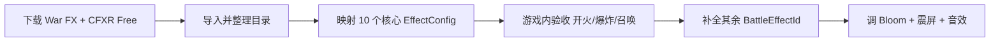

# 炫酷战斗特效素材清单与接入指南

更新时间：2026-06-01  
适用工程：`douyin-danmu-Unity3D`（Unity 2022.3 LTS，**Built-in 渲染管线**）

本文件在 `doc/免费素材与特效环境搭建.md` 基础上，补充「全网可拿、适合弹幕大战、能直接挂到 `EffectManager`」的特效包，并给出与本项目 `BattleEffectId` 的映射表。

---

## 1. 先选风格（二选一或混搭）

| 风格 | 观感 | 适合直播弹幕大战 | 首推包 |
| --- | --- | --- | --- |
| **卡通炫酷** | 高饱和、HDR 发光、震屏感强 | 观众一眼看懂「炸了/放了技能」 | [Cartoon FX Remaster Free](https://assetstore.unity.com/packages/vfx/particles/cartoon-fx-remaster-free-109565) |
| **写实战争** | 枪口焰、尘土命中、浓烟爆炸 | 偏「真实战场」气质 | [War FX](https://assetstore.unity.com/packages/vfx/particles/war-fx-5669)（免费） |
| **轻量补充** | 2D 序列帧贴图，程序粒子兜底 | 填缝、移动端省性能 | [Kenney Particle Pack](https://kenney.nl/assets/particle-pack) + [CGHEVEN VFX](https://cgheven.com) |

当前工程已有程序生成的 fallback 粒子（`Assets/Resources/VFX/Online/Selected/`）。要「明显更炫」，**优先导入带 Prefab 的 Unity 包**，把 `EffectConfig.prefab` 填上官方预制体，而不是只换 PNG。

---

## 2. 必下清单（免费 + 商用友好）

### Tier S — 与 Built-in 管线最匹配（强烈建议）

| 资源 | 地址 | 体积约 | 许可证 | 导入目录 |
| --- | --- | --- | --- | --- |
| **War FX** | https://assetstore.unity.com/packages/vfx/particles/war-fx-5669 | ~9 MB | Unity Asset Store EULA，**免费** | `Assets/ThirdParty/UnityAssetStore/WarFX/` |
| **Cartoon FX Remaster Free** | https://assetstore.unity.com/packages/vfx/particles/cartoon-fx-remaster-free-109565 | ~13 MB | 同上，**免费**；支持 Built-in + URP | `Assets/ThirdParty/UnityAssetStore/CartoonFXRemasterFree/` |
| **Simple FX Cartoon Particles** | https://marketplace.unity.com/packages/vfx/particles/simple-fx-cartoon-particles-67834 | 较小 | 免费 EULA | `Assets/ThirdParty/UnityAssetStore/SimpleFX/` |

说明：

- **War FX**（Jean Moreno）：40+ 战争特效，含爆炸/火焰/烟雾/枪口焰/弹着点，带 **CFX Spawn System** 对象池思路，与本项目 `EffectManager` 一致。
- **Cartoon FX Remaster Free**：从商业包抽样的高亮爆炸、魔法、命中、烟雾；带 **Camera Shake**、点光源，直播观感最好。
- 两者同一作者生态，Shader 与编辑器工具（CFX Easy Editor）可共用。

交互预览（选特效前先看）：

- War FX：https://www.jeanmoreno.com/unity/warfx/
- Cartoon FX 图库：https://www.jeanmoreno.com/unity/cartoonfxremaster_gallery/

### Tier A — CC0 / 免署名贴图与序列帧

| 资源 | 地址 | 用途 | 导入目录 |
| --- | --- | --- | --- |
| **Kenney Particle Pack** | https://kenney.nl/assets/particle-pack | 80+ 粒子精灵、部分 Unity 示例 | `Assets/ThirdParty/Kenney/ParticlePack/` |
| **CGHEVEN VFX** | https://cgheven.com （搜 muzzle / explosion） | CC0 枪口焰、爆炸 Flipbook、部分 VDB | `Assets/DownloadedAssets/VFX/CGHEVEN/` |
| **OpenGameArt Kenney 镜像** | https://opengameart.org/content/particle-pack-80-sprites | 与 Kenney 包相同，备用下载 | 同上 |

### Tier B — 可选增强（注意管线）

| 资源 | 地址 | 注意 |
| --- | --- | --- |
| **Free Fire VFX** | https://assetstore.unity.com/packages/vfx/particles/fire-explosions/free-fire-vfx-266227 | 仅 **Built-in**，无 URP/HDRP |
| **Unity 商店搜索** | https://assetstore.unity.com/vfx/particles/fire-explosions → Price: Free | 筛选 `Fire & Explosions`，逐个看预览 |
| **itch.io 免费 VFX** | https://itch.io/game-assets/free/tag-unity/tag-vfx | 多为 URP 包，导入前看说明；可搜 `explosion` |
| **codemanu VFX Free Pack** | https://codemanu.itch.io/vfx-free-pack | 杂项 royalty-free，需逐个预览 |

### 不建议本项目优先

| 资源 | 原因 |
| --- | --- |
| 仅 HDRP/URP 的爆炸包 | 工程未启用 URP/HDRP（`GraphicsSettings` 无自定义 RP） |
| 纯视频 `.mov` 素材 | 需额外插件或自己转 Flipbook，工作量大 |
| 盗版/「VIP 破解」合集站 | 无许可证，不可用于商用直播 |

---

## 3. 与本项目 `BattleEffectId` 的推荐映射

导入 Prefab 后，在 Unity 里打开预制体，按下表绑定到 `Assets/Resources/Battle/Effects/Effect_*.asset` 的 **Prefab** 字段（或重新跑 **Apocalypse King → Setup Project Assets** 后手动指定）。

| BattleEffectId | 推荐 War FX（写实） | 推荐 Cartoon FX Remaster Free（炫酷） |
| --- | --- | --- |
| `MuzzleRifle` | `WFX_Muzzle Flash` 系列 | `CFXR Muzzle` / `CFXR2 Muzzle` |
| `MuzzleTank` | 大口径 Muzzle | `CFXR Explosion Quick` 缩小作炮口 |
| `MuzzleAircraft` | 小型 Flash + Smoke | `CFXR Fire` 相关 |
| `ShellLaunchSmoke` | `WFX_Smoke` Gray/White | `CFXR Explosion Smoke` |
| `BombDropTrail` | `WFX_Smoke` White 拖尾 | `CFXR4 Fire` 细烟 |
| `ShellExplosionSmall` | `WFX_Explosion Small` | `CFXR Explosion 1` |
| `ShellExplosionLarge` | `WFX_Explosion Ground` | `CFXR2 Explosion (Lit)` / `CFXR4 Explosion Orange` |
| `BombExplosion` | `WFX_Explosion Aerial` | `CFXR4 Explosion Orange (HDR)` |
| `BulletHitMetal` | `WFX_BImpact Metal` | `CFXR Hit` 金属火花 |
| `BulletHitDirt` | `WFX_BImpact Sand/Dirt` | 尘土 Hit |
| `MonsterHammerImpact` | `WFX_Explosion Small` + Impact | `CFXR2 WW Explosion` |
| `MonsterShockwave` | —（保留程序冲击环） | `CFXR Shockwave` 类（若有） |
| `HumanSummon` | `WFX_Explosion Soft` | `CFXR Magic` 蓝系 |
| `OrcSummon` | 同上偏红 | `CFXR4 Monster Explosion Purple` |
| `HumanAirStrikeWarning` | `WFX_Explosion` 预警圈 | `CFXR4 Sparks Explosion` + 蓝圈 |
| `OrcRageBuff` | `WFX_Fire Chemical` | `CFXR Magic` 红系 |
| `TankDeathExplosion` | `WFX_Explosion Ground` | `CFXR2 Explosion` |
| `MonsterDeathExplosion` | `WFX_Explosion Massive` | `CFXR4 Monster Explosion` |
| `SoldierDeath` | `WFX_BImpact Dirt` | 小型 Hit + 尘 |

命名以资源包内实际 Prefab 为准；上表为搜索关键词，在 Project 窗口搜 `WFX_`、`CFXR` 最快。

---

## 4. 导入与目录规范

### 4.1 Unity Asset Store 包

1. Unity 菜单 **Window → Package Manager**，左上角选 **My Assets**。
2. 搜索并 **Download**，再 **Import**（建议全选导入，或至少 `Prefabs` + `Materials` + `Shaders`）。
3. 将内容移到规范目录（不要长期留在 `Assets/JMO Assets/` 根下散乱状态）：

```text
Assets/ThirdParty/UnityAssetStore/
  WarFX/
  CartoonFXRemasterFree/
  SimpleFX/
```

4. 在 `doc/许可证/` 新建记录（模板见 `doc/免费素材与特效环境搭建.md` §3）。

### 4.2 绑定到 EffectManager

```text
1. 打开 Assets/Resources/Battle/Effects/Effect_MuzzleRifle.asset
2. 将 War FX 或 CFXR 的枪口 Prefab 拖到 Effect Config → Prefab
3. 保存场景 ApocalypseKing（EffectManager 已挂 BattleEffectsCatalog）
4. Play 模式测试：士兵开火 / 坦克炮 / 空袭弹幕
```

批量方式（推荐）：

- 菜单 **Apocalypse King → Setup Project Assets**，会刷新 `EffectConfig` 资源；
- 再用 Editor 脚本批量指定 Prefab（见下节「可选自动化」）。

### 4.3 画面更「炫」的渲染设置（Built-in）

在 **ApocalypseKing** 场景或主相机上建议：

| 项 | 建议值 | 作用 |
| --- | --- | --- |
| Bloom（后处理栈或体积） | 低开销阈值，强度 0.3–0.6 | CFXR / HDR 爆炸发光 |
| 允许 HDR | Camera HDR on | 高亮粒子不夹灰 |
| 粒子最大数 | Quality → Particle Raycast Budget 适中 | 弹幕高峰不截断 |

Cartoon FX 预制体若带 `CFXR_Effect` 脚本，可开启 **Camera Shake**；与本项目 `TriggerCameraShake` 叠加时注意幅度，避免晕屏。

---

## 5. 性能与直播稳定性

| 原则 | 做法 |
| --- | --- |
| 对象池 | 继续用 `EffectManager`，不要 `Instantiate` 裸实例化 |
| 同屏上限 | 保持各 `EffectConfig.maxCount`（已按类型区分） |
| 移动版 | 用资源包里的 **Mobile** 变体（War FX 常带 `_Mobile` 后缀） |
| 碰撞 | 爆炸/烟雾关闭 `allowParticleCollision`；仅火花类开启 |
| 音频 |  Explosion 绑定 `AudioCueConfig` + Sonniss/Pixabay 短音效 |

---

## 6. 推荐实施顺序（约 1–2 天）



**第一天（视觉冲击最大）**

1. Cartoon FX：`CFXR4 Explosion Orange`、`CFXR Muzzle`、`CFXR4 Monster Explosion`
2. War FX：步枪/坦克枪口、小爆炸、金属命中
3. 替换 `HumanSummon` / `OrcSummon` / `MonsterDeathExplosion`

**第二天（打磨）**

1. 烟雾拖尾、建筑摧毁、飞机坠毁烟
2. 弹幕技能 `HumanAirStrikeWarning`、`OrcRageBuff` 专用预制体
3. 写许可证文件、更新 `doc/实现进度记录.md`

---

## 7. 已自动导入 Kenney（无需 Asset Store 登录）

```powershell
.\tools\import-free-vfx.ps1
```

- 安装路径：`Assets/Kenney/Particle samples/`（Fire / Smoke / Magic / Sparks / Electricity prefab）
- 贴图：`Assets/Resources/VFX/Online/Selected/*.png`（含爆炸 flipbook）
- 自动绑定：`EffectConfig.prefab` → Kenney prefab

## 8. 工程内自动化（商店包 + 绑定）

导入 War FX / Cartoon FX 后，Unity 菜单任选其一：

```text
Apocalypse King → Bind Store VFX Prefabs to Effect Configs
Apocalypse King → Setup Project Assets   （含绑定步骤）
.\tools\setup-unity-assets.ps1            （批处理同样会尝试绑定）
```

`ApocalypseKingVfxPrefabBinder` 会按 prefab 名称关键字写入 `Assets/Resources/Battle/Effects/Effect_*.asset` 的 **Prefab** 与 **prefabScaleMultiplier**。未导入商店包时跳过，仍使用程序 fallback 粒子。

手动微调：打开单个 `EffectConfig` 覆盖 prefab 或倍率。运行游戏验证：

```powershell
.\build-and-start.bat
.\tools\send-danmu-test.ps1 -Full
```

若需批量绑定 Prefab，可新增 Editor 菜单（后续任务）：扫描 `Assets/ThirdParty/UnityAssetStore/**` 下 `*.prefab`，按文件名关键字写入对应 `EffectConfig`——**必须在资源包导入完成后执行**。

---

## 9. 付费升级（仍值得了解，非必须）

直播长期运营可考虑同一作者的完整包（非免费）：

| 包 | 地址 | 说明 |
| --- | --- | --- |
| Cartoon FX Remaster Bundle | Asset Store 搜 `Cartoon FX Remaster Bundle` | 四包合集，特效数量约为 Free 版的数十倍 |
| Cartoon FX 1–4 Remaster | 分别购买 | 按主题选：魔法/战争/科幻/怪物 |

当前 **War FX + Cartoon FX Remaster Free** 已足够把观感从「程序小粒子」拉到「商业弹幕游戏」档位。

---

## 10. 快速链接汇总

| 名称 | URL |
| --- | --- |
| War FX（免费） | https://assetstore.unity.com/packages/vfx/particles/war-fx-5669 |
| Cartoon FX Remaster Free | https://assetstore.unity.com/packages/vfx/particles/cartoon-fx-remaster-free-109565 |
| Simple FX Cartoon | https://marketplace.unity.com/packages/vfx/particles/simple-fx-cartoon-particles-67834 |
| Kenney Particle Pack | https://kenney.nl/assets/particle-pack |
| CGHEVEN 免费 VFX | https://cgheven.com |
| Unity 免费爆炸分类 | https://assetstore.unity.com/vfx/particles/fire-explosions |
| itch.io 免费 Unity VFX | https://itch.io/game-assets/free/tag-unity/tag-vfx |
| 项目已有搭建文档 | `doc/免费素材与特效环境搭建.md` |

---

## 11. 下一步（War FX / CFXR 需本机 Unity）

Asset Store 包**不能**在无登录时代下。菜单 **Apocalypse King → Import Asset Store VFX (Open Download Pages)**，在 Package Manager 里 Download + Import 后执行 **Bind Store VFX Prefabs**。

Kenney 已可通过 `import-free-vfx.ps1` 完成；重建游戏：

```powershell
.\build-and-start.bat
```

## 12. 原「下一步」备忘

1. 在 Unity Hub 打开工程，登录 Asset Store 账号，下载 **War FX** + **Cartoon FX Remaster Free**。
2. Import 后把 Prefab 路径发我，或自行按 §3 表绑定到 `EffectConfig`。
3. 需要的话我可以再加 **Editor 一键绑定脚本** + **默认 Bloom 场景配置**，把「找素材」和「实现」连成一条菜单。
